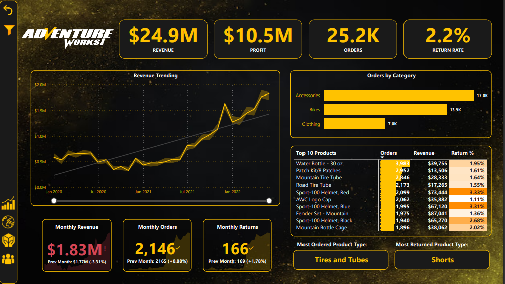

# AdventureWorks Dashboard

Welcome to the AdventureWorks Dashboard, a comprehensive data visualization tool designed to provide insights into the company's performance, focusing on revenue, orders, returns, and product/customer details. This README file will guide you through the different pages and functionalities of the dashboard.

## Table of Contents
1. [Getting Started](#getting-started)
2. [Dashboard Overview](#dashboard-overview)
3. [Page 1: Overview](#page-1-overview)
4. [Page 2: Geographic Insights](#page-2-geographic-insights)
5. [Page 3: Product Details](#page-3-product-details)
6. [Page 4: Customer Details](#page-4-customer-details)
7. [Page 5: Tree Composition](#page-5-tree-composition)

## Dashboard Overview

The AdventureWorks Dashboard is a data visualization tool built to analyze key metrics and trends for the AdventureWorks company. It consists of five pages, each focusing on different aspects of the company's performance.

## Page 1: Overview

### Features

1. Line chart of revenue trending
2. Bar chart of orders by category
3. Cards displaying revenue, profit, orders, return rate, monthly revenue, monthly orders, and monthly returns
4. Table chart for top 10 products with return rate and revenue
5. Cards showing most ordered and most returned product types
6. Slicer for year and continent in a collapsible panel on the left

### Usage

1. Open the dashboard.
2. Explore the line and bar charts for revenue and orders.
3. Check the cards for monthly insights and top products.
4. Utilize the slicer panel to filter data by year and continent.

